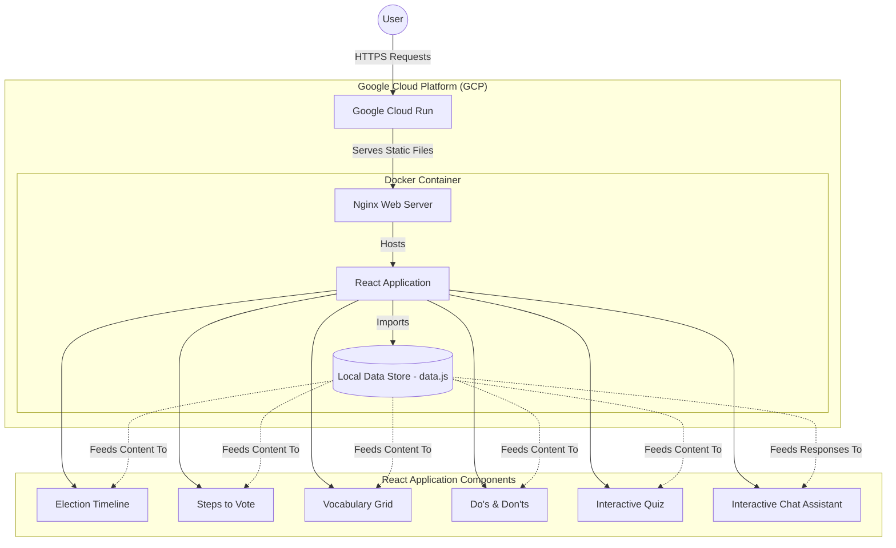

# 🗳️ Election Assistant

An interactive, responsive web application designed to help users understand the election process, timelines, and necessary steps. Built with modern web technologies, this project features a dynamic user interface with a built-in chatbot, educational quizzes, and automated deployment to Google Cloud Platform.

## 🌟 Live Demo

The application is deployed and publicly accessible via Google Cloud Run:
👉 **[View Live Application](https://election-assistant-440970154403.us-central1.run.app)**

## 🚀 Features

- **📅 Interactive Timeline:** A visual, animated timeline showcasing key election dates (registration deadlines, early voting, etc.).
- **✅ Steps to Vote:** A clear, numbered guide walking users through the voting process from checking eligibility to casting a ballot.
- **📚 Election Vocabulary:** A responsive glossary of common political jargon (e.g., Ballot, Incumbent, Gerrymandering) to educate users.
- **👍 Voting Do's and Don'ts:** A highlighted list of best practices and things to avoid at the polling station.
- **🧠 Knowledge Check:** An interactive, score-tracked quiz to test the user's understanding of the election process.
- **💬 Interactive Chat Assistant:** A dynamic, keyword-driven chatbot that provides instant answers to user questions about registration, polling places, and absentee voting.

## 🛠️ Technology Stack

- **Frontend:** React.js, Vite, Vanilla CSS (Premium Glassmorphism UI)
- **Icons:** Lucide React
- **Containerization:** Docker, multi-stage builds (Node.js & Nginx)
- **Deployment:** Google Cloud Run, Google Artifact Registry
- **Version Control:** Git, GitHub CLI

## 🏗️ Architecture Diagram



## 💻 Local Development Setup

To run this project locally on your machine:

1. **Clone the repository:**
   ```bash
   git clone https://github.com/Avi10jana/election-assistant.git
   cd election-assistant
   ```

2. **Install dependencies:**
   ```bash
   npm install
   ```

3. **Start the development server:**
   ```bash
   npm run dev
   ```
   *The application will typically be available at `http://localhost:5173`.*

## ☁️ Deployment

This project includes a `Dockerfile` and a `deploy.ps1` PowerShell script for automated deployment to Google Cloud Run.

1. Ensure you have the `gcloud` CLI installed and authenticated.
2. Update the `$PROJECT_ID` variable in `deploy.ps1` with your GCP project ID.
3. Run the deployment script:
   ```powershell
   .\deploy.ps1
   ```
