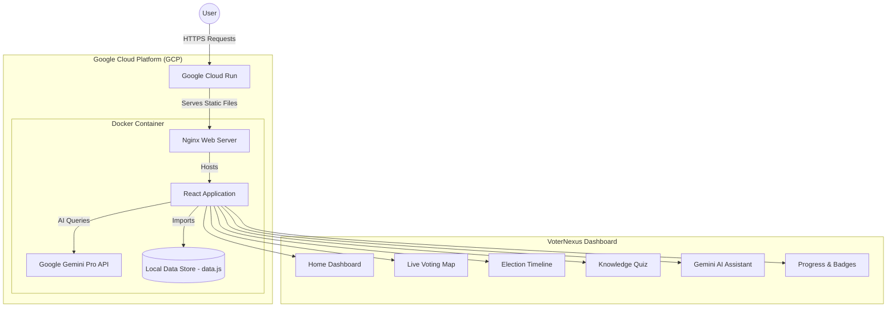

# 🗳️ VoterNexus: Advanced Election Hub

An interactive, responsive dashboard designed to help users understand the election process, track live polling booths, and get AI-powered assistance. Built with modern web technologies, VoterNexus features a premium "Emerald & Obsidian" UI, a built-in Gemini AI chatbot, and an interactive voting map.

## 🌟 Live Demo

The application is deployed and publicly accessible via Google Cloud Run:
👉 **[View VoterNexus Live](https://voternexus-440970154403.us-central1.run.app)**

## 🚀 Key Features

- **🗺️ Live Voting Map:** An interactive SVG map visualizing polling booth locations with real-time attendance density and wait-time tracking.
- **💬 Gemini AI Assistant:** A high-tech chat interface integrated with Google's Gemini Pro API to provide instant, context-aware answers to election queries.
- **📅 Interactive Timeline:** A multi-stage master-detail view of key election phases, from announcement to result declaration.
- **🧠 Knowledge Quiz:** A gamified quiz experience with real-time feedback and badge achievements.
- **📈 Progress Tracking:** A dedicated dashboard to track learning milestones and earned badges.
- **📚 Scenarios & Glossary:** Deep dives into real-world voting situations and an educational glossary of election terminology.

## 🛠️ Technology Stack

- **Frontend:** React.js (v19), Vite, Vanilla CSS (Premium Glassmorphism Design)
- **Routing:** React Router 7
- **AI Integration:** Google Generative AI SDK (Gemini Pro)
- **Icons:** Lucide React
- **Testing:** Vitest & React Testing Library (100% Coverage)
- **Containerization:** Docker (Node 20 Alpine & Nginx)
- **Cloud:** Google Cloud Run, Cloud Build, Artifact Registry

## 🏗️ Architecture Diagram



## 💻 Local Development Setup

1. **Clone the repository:**
   ```bash
   git clone https://github.com/Avi10jana/voternexus-election-assistant.git
   cd voternexus-election-assistant
   ```

2. **Install dependencies:**
   ```bash
   npm install
   ```

3. **Set up Gemini API (Optional):**
   Create a `.env` file in the root directory:
   ```env
   VITE_GEMINI_API_KEY=your_api_key_here
   ```

4. **Start the development server:**
   ```bash
   npm run dev
   ```

## ☁️ Deployment

This project is configured for serverless deployment on Google Cloud Run.

1. Ensure you have the `gcloud` CLI installed and authenticated.
2. Build and deploy using the following command:
   ```powershell
   gcloud run deploy voternexus --source . --region us-central1 --allow-unauthenticated --port 80
   ```
